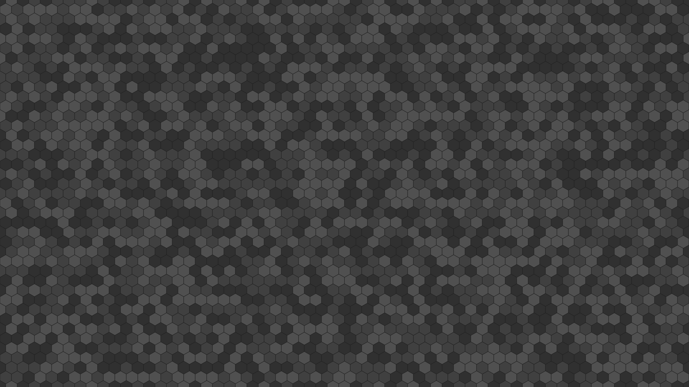
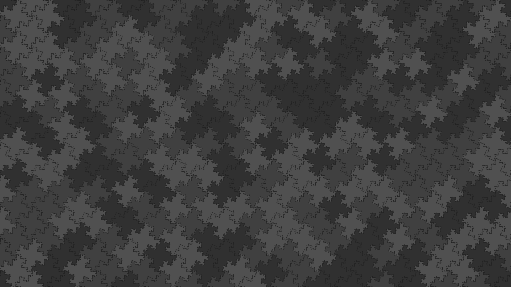

# Seamless geometric wallpapers

The SVG wallpapers in the `wallpapers` directory have been generated using Python code contained in the `scripts` directory. [Nix](https://nixos.org/) packages contained in this [flake](https://nixos.wiki/wiki/Flakes) render PNGs from the pre-generated SVGs, optionally re-colored using a customized palette to match the color scheme of the user's desktop theme.

## Gallery

### Tilings of the plane using randomly colored islands

#### `hexagons`

<a href="wallpapers/hexagons.svg">
  
</a>

#### `gosperflakes2`

[Gosper islands](https://mathworld.wolfram.com/GosperIsland.html) (2 iterations)

<a href="wallpapers/gosperflakes2.svg">
  
</a>

#### `kochflakes3`

[Koch islands](https://mathworld.wolfram.com/KochSnowflake.html) (3 iterations)

<a href="wallpapers/kochflakes3.svg">
  
</a>

#### `minkowskiflakes4`

[Minkowski islands](https://mathworld.wolfram.com/MinkowskiSausage.html) (4 iterations)

<a href="wallpapers/minkowskiflakes4.svg">
  
</a>

## SVG generation and rendering

Clone this repo using `git`, and enter the repo directory.

Wallpapers with the default palette can be built as
```sh
nix-build -E '(import ./pkgs { }).hexagons'
```
or using Flakes-enabled Nix as
```sh
nix build .#hexagons
```

The generated SVG and PNG files are contained within the `result` subdirectory.

The palette can be customized when building as
```sh
nix-build -E '
(import ./pkgs { }).hexagons.override {
  palette = ["#000000" "#3f1f0f" "#7f3f1f" "#ff7f3f"];
}'
```
or using Flakes-enabled Nix as
```sh
nix build --impure --expr '
(import ./pkgs { }).hexagons.override {
  palette = ["#000000" "#3f1f0f" "#7f3f1f" "#ff7f3f"];
}'
```

## Development

### First steps

Clone this repo using `git`, and enter the repo directory. Open a development shell as
```sh
nix-shell
```
or using Flakes-enabled Nix as
```sh
nix develop
```

This repository follows the [Conventional Commits](https://www.conventionalcommits.org/en/v1.0.0/) specification. To enforce it, install the `gitlint` commit-msg hook on the first occasion as
```sh
gitlint install-hook
```

### Running the SVG generators

The SVG-generating Python scripts can be run from within the Nix development shell as
```sh
python scripts/hexagons.py > /tmp/hexagons.svg
```
where the script name and the output path should be customized.

### Testing and formatting

Unit testting and linting of the SVG-generator Python code as well as checking of the flake itself can be run using Flakes-enabled Nix as
```sh
nix flake check
```
There is currently no automatic re-formatting, it is expected to be run manually. For the SVG-generator Python code, enter the Nix development shell
while inside the repo directory and run
```sh
black scripts tests
```
while for the Nix code, run (using Flakes-enabled Nix)
```sh
nix fmt
```

## References

The randomly colored hexagonal grid pattern was inspired by paepaestockphoto's artwork at

https://www.vecteezy.com/vector-art/6941002-small-hexagon-shape-with-light-white-and-grey-color-seamless-pattern-background
